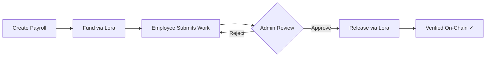

# PayrollStream 💸

**On-Chain Salary Verification · Algorand TestNet**

> **[🌐 Live Demo →](https://lakshman-reddy-sudo.github.io/payrollstream/)**

PayrollStream is a milestone-based payroll streaming platform built on Algorand. It enables real-time salary accrual, admin-verified milestone releases, and fully on-chain transaction verification via [Lora Explorer](https://lora.algokit.io/testnet).


---

## ✨ Features

### 🔄 Live Salary Streaming
- Real-time salary ticker that accrues per-second based on payroll start/end dates
- Visual progress bar showing percentage of salary earned
- Live rate display (ALGO/second)

### 🏗️ Milestone-Based Verification
- Define payroll milestones with percentage-based allocation
- Full workflow: **Submit → Approve → Release** (or Reject → Resubmit)
- Each milestone release is an independent on-chain transaction

### 👤 Role-Based Access
| Role | Capabilities |
|------|-------------|
| **Admin (Employer)** | Create payrolls, fund contracts, review submissions, approve/reject milestones, release salary, mark early completion |
| **Employee** | View earned salary, submit milestone work, log expenses, request payouts |

### ⚡ Admin Early Completion
- Admins can **"Mark Complete Early"** when employees finish ahead of schedule
- Instantly sets the salary ticker to 100% — no waiting for the time limit
- Enables immediate full payout

### 🔗 On-Chain Verification
- All salary releases via Algorand transactions
- **Lora Explorer** integration for transaction composition and verification
- Paste transaction IDs for on-chain proof — verified in real-time
- Full audit trail with clickable Lora links

### 📊 Analytics Dashboard
- Aggregate payroll statistics (total funded, released, release rate)
- Milestone status distribution (bar chart visualization)
- Top payrolls leaderboard
- Complete transaction log

### 🌐 Public Transparency View
- Publicly accessible view of all payrolls — no login required
- Live salary tickers, milestone progress, and on-chain data
- Full transparency for stakeholders

---

## 🛠️ Tech Stack

| Technology | Purpose |
|-----------|---------|
| **React 19** | Frontend UI framework |
| **Vite 7** | Build tool & dev server |
| **Algorand SDK** (`algosdk`) | Blockchain interaction |
| **Pera Wallet** (`@perawallet/connect`) | Wallet connection |
| **Defly Wallet** (`@blockshake/defly-connect`) | Alternative wallet |
| **Lora Explorer** | Transaction composition & verification |

---

## 🚀 Getting Started

### Prerequisites
- [Node.js](https://nodejs.org/) (v18+)
- [npm](https://www.npmjs.com/) or yarn

### Installation

```bash
# Clone the repository
git clone https://github.com/lakshman-reddy-sudo/payrollstream.git

# Navigate to the project
cd payrollstream

# Install dependencies
npm install

# Start the dev server
npm run dev
```

The app will be available at `http://localhost:5173/`

### Build for Production

```bash
npm run build
```

---

## 📖 How It Works

```
01 → Connect your wallet (Pera or Defly) (optional, for display)
02 → Create a Payroll Stream (define salary, milestones, timeline)
03 → Submit & Verify Milestones (employee submits, admin reviews)
04 → Release Salary On-Chain (verified Algorand transactions via Lora)
```

### Local Data Reset
- A **Clear All Data** button is available on the Login screen to wipe app data stored in `localStorage` (payrolls, auth, etc.).

### Payroll Lifecycle



### Salary Accrual
- Salary accrues in real-time on the frontend based on `startTime` and `endTime`
- The live ticker updates every second using `computeEarnedSalary()`
- Admins can "Mark Complete Early" to set the timer to 100% if work finishes ahead of schedule

### On-Chain Flow
1. Admin clicks **"Approve & Release"** on an approved milestone
2. **Lora Composer** opens in a new tab to create the Algorand payment transaction
3. Admin signs and submits the transaction via Lora
4. Admin pastes the **Transaction ID** back into PayrollStream
5. PayrollStream **verifies** the transaction on Algorand TestNet
6. Milestone is marked as **Released** with a clickable Lora link

---

## 🎨 Design System

**AlgoID-Inspired Dark Theme** with:
- Deep obsidian backgrounds (`#060d0b`, `#0c1614`)
- Teal/emerald accent (`#00e6b0`)
- Rounded corners and pill-shaped buttons
- DM Sans (body) + Space Mono (numbers/code)
- Glassmorphic navbar with backdrop blur
- Smooth hover animations and micro-interactions

---

## 📁 Project Structure

```
PayrollStream/
├── index.html              # Entry HTML with font imports
├── src/
│   ├── main.jsx            # React entry point
│   ├── App.jsx             # App shell, routing, navbar
│   ├── index.css           # AlgoID design system
│   ├── pages/
│   │   ├── Login.jsx       # Role selection (Admin/Employee)
│   │   ├── Landing.jsx     # Hero page with workflow steps
│   │   ├── Dashboard.jsx   # Payroll cards, actions, stats
│   │   ├── CreateGrant.jsx # Create payroll form with milestones
│   │   ├── GrantDetail.jsx # Salary ticker, milestone timeline
│   │   ├── Analytics.jsx   # Charts, stats, transaction log
│   │   └── PublicView.jsx  # Public transparency dashboard
│   └── utils/
│       ├── store.js        # localStorage data layer
│       ├── algorand.js     # Algorand SDK helpers
│       └── wallet.js       # Pera/Defly wallet connection
├── package.json
└── vite.config.js
```

---

## 🔑 Key Functions

| Function | File | Purpose |
|----------|------|---------|
| `computeEarnedSalary()` | `store.js` | Calculates real-time salary accrual |
| `verifyTransaction()` | `algorand.js` | Verifies Algorand txn on TestNet |
| `getLoraComposeUrl()` | `algorand.js` | Opens Lora transaction composer |
| `createMultisigAddress()` | `algorand.js` | Creates multisig escrow address |
| `connectWallet()` | `wallet.js` | Connects selected wallet (Pera/Defly) |
| `getWalletTypes()` | `wallet.js` | Wallet options shown in the Login selector |
| `clearAllData()` | `store.js` | Clears app data from `localStorage` |

---

## 📜 License

MIT © 2025 PayrollStream

---

<p align="center">
  <strong>Built on <a href="https://algorand.co">Algorand</a> · Verified via <a href="https://lora.algokit.io/testnet">Lora Explorer</a></strong>
</p>
